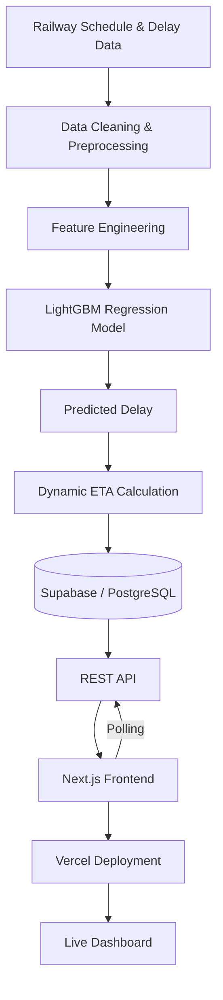

# 🚆 Journey — Dynamic Railway ETA Prediction

An ML-powered railway monitoring and ETA prediction platform that provides dynamic train arrival estimates using railway schedule data, station-level information, and machine learning.

**🌐 Live Demo:** [journey-ijym.vercel.app](https://journey-ijym.vercel.app/)
**📂 Repository:** [github.com/vasireddikeerthika/Journey](https://github.com/vasireddikeerthika/Journey)

---

## 📌 About

Journey combines railway schedule data, delay information, machine learning, backend services, and an interactive dashboard to provide continuously updated train ETA information.

Instead of relying only on static scheduled timings, the system uses a **LightGBM regression model** trained on railway delay patterns to predict delay and calculate a **dynamic ETA**.

---

## 🏗️ Architecture



---

## 👩‍💻 My Role

**Machine Learning, Backend, Integration & Deployment — Keerthika Sai Vasireddi**

I handled the project **except for frontend development**, including:

* 🧹 Data cleaning and preprocessing
* ⚙️ Feature engineering
* 🤖 LightGBM model development and training
* 📈 Model evaluation using MAE
* ⏱️ ETA prediction pipeline
* 🔄 Dynamic delay correction
* 🗄️ Supabase/PostgreSQL integration
* 🔌 Application and data integration
* 🔄 Polling-based updates
* 🚀 Vercel deployment and live application integration

---

## 🤖 Machine Learning

**Model:** LightGBM Regression
**Evaluation Metric:** Mean Absolute Error (MAE)
**Model MAE:** **5.6 minutes**

### Features Used

| Feature                | Description                                   |
| ---------------------- | --------------------------------------------- |
| Station number         | Sequence position of the station on the route |
| Scheduled running time | Planned travel time between stations          |
| Previous station delay | Delay recorded at the previous station        |
| Day of week            | Captures weekly delay patterns                |
| Month                  | Captures seasonal variation                   |
| Train type             | Train category                                |
| Station zone           | Railway zone of the station                   |

### Data Processing

The pipeline cleans and combines railway schedule and delay data, performs feature engineering, and prepares station-level records for model training and prediction.

---

## 🛠️ Tech Stack

| Layer          | Technologies                           |
| -------------- | -------------------------------------- |
| **ML**         | Python, Pandas, Scikit-learn, LightGBM |
| **Backend**    | Supabase, PostgreSQL, REST API         |
| **Frontend**   | Next.js                                |
| **Deployment** | Vercel                                 |

---

## 🔄 Dynamic ETA

Journey uses predicted delay together with scheduled journey information to calculate updated arrival estimates.

```text
Scheduled ETA
      +
Predicted Delay
      ↓
Dynamic ETA
      ↓
Updated Train Information
```

The application uses **polling-based updates** to periodically retrieve updated information without requiring a complete manual page refresh.

---

## 🚀 Deployment

The application is deployed using **Vercel** and integrated with the project's backend and data services.

**🌐 Live Application:**
https://journey-ijym.vercel.app/

---

## 🔮 Future Enhancements

* 🗺️ Station-to-station journey visualization
* 🌐 Telugu and Hindi language support
* 📱 Real-time delay notifications
* 📊 Historical delay trends
* 🔄 Automated model retraining with new data

---

## 📄 License

This project was developed for educational and project demonstration purposes.
